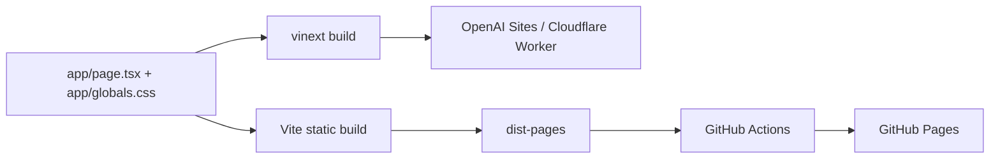
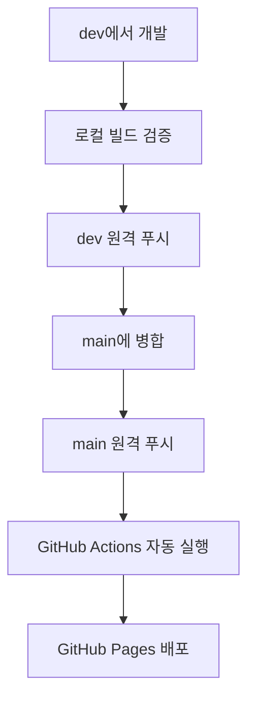

# 옥션홈 GitHub Pages 배포 흐름

이 문서는 옥션홈 프로젝트를 로컬에서 개발하고 `dev` 브랜치에서 검증한 뒤 `main` 브랜치를 통해 GitHub Pages에 자동 배포하는 전체 과정을 설명합니다.

## 1. 배포 구조

이 저장소는 하나의 화면 코드를 두 가지 방식으로 빌드합니다.

- `npm run build`: OpenAI Sites와 Cloudflare Workers에 맞는 vinext 서버 빌드
- `npm run build:pages`: GitHub Pages에 맞는 순수 정적 HTML·CSS·JavaScript 빌드

GitHub Pages는 서버 코드를 실행하지 않으므로 `github-pages/index.html`과 `github-pages/main.tsx`가 정적 진입점 역할을 합니다. 실제 화면은 `app/page.tsx`와 `app/globals.css`를 그대로 가져와 사용하므로 두 배포본의 UI와 기능이 동일하게 유지됩니다.



## 2. 관련 파일

- `github-pages/index.html`: GitHub Pages용 HTML 문서와 검색·공유 메타데이터
- `github-pages/main.tsx`: React 화면을 정적 페이지에 마운트하는 진입점
- `vite.pages.config.ts`: `/apart-auction/` 하위 경로와 정적 출력 폴더 설정
- `.github/workflows/pages.yml`: 빌드와 배포를 자동화하는 GitHub Actions 워크플로
- `dist-pages/`: 정적 빌드 결과물. 자동 생성되며 Git에는 커밋하지 않음

## 3. 브랜치 흐름

기능 개발은 `dev`, 실제 배포는 `main`을 기준으로 합니다.



권장 명령은 다음과 같습니다.

```bash
git switch dev
git pull --ff-only origin dev

# 변경 후 검증
npm run build
npm run build:pages

git add <변경한 파일>
git commit -m "변경 내용 요약"
git push origin dev

# 검토 후 main 반영
git switch main
git pull --ff-only origin main
git merge --ff-only dev
git push origin main
```

팀 작업에서는 `dev`에서 `main`으로 Pull Request를 열어 리뷰 후 병합하는 방법을 권장합니다.

## 4. 로컬 정적 빌드

Node.js 22.13 이상에서 의존성을 설치합니다.

```bash
npm ci
npm run build:pages
```

성공하면 `dist-pages/index.html`과 해시가 포함된 CSS·JavaScript 파일이 생성됩니다. 배포 경로가 저장소 이름과 같은 `/apart-auction/`이므로 이미지와 스크립트 주소도 이 하위 경로를 기준으로 만들어집니다.

정적 빌드를 로컬에서 확인하려면 다음 명령을 사용합니다.

```bash
npm run preview:pages
```

## 5. GitHub Actions 실행 과정

`.github/workflows/pages.yml`은 다음 두 경우에 실행됩니다.

1. `main` 브랜치에 커밋이 푸시될 때
2. GitHub의 **Actions → Deploy GitHub Pages → Run workflow**에서 수동 실행할 때

워크플로는 아래 순서로 동작합니다.

1. 저장소 코드를 체크아웃합니다.
2. Node.js 22 환경을 준비합니다.
3. `npm ci`로 잠금 파일과 동일한 의존성을 설치합니다.
4. GitHub Pages 환경을 설정합니다.
5. `npm run build:pages`로 정적 파일을 생성합니다.
6. `dist-pages`를 Pages 아티팩트로 업로드합니다.
7. `github-pages` 환경에 아티팩트를 배포합니다.

워크플로에는 최소 권한만 부여합니다.

- `contents: read`: 저장소 코드 읽기
- `pages: write`: Pages 배포 생성
- `id-token: write`: 배포 요청 인증

## 6. 배포 주소와 상태 확인

기본 배포 주소는 다음과 같습니다.

<https://easygoing2.github.io/apart-auction/>

배포 상태는 저장소의 **Actions** 탭 또는 **Settings → Pages**에서 확인할 수 있습니다. 첫 배포는 주소가 활성화되기까지 잠시 걸릴 수 있습니다.

## 7. 화면과 데이터의 동작 범위

현재 화면의 검색, 정렬, 상세 보기 기능은 브라우저에서 실행되므로 GitHub Pages에서도 그대로 작동합니다. 관심 물건은 브라우저의 `localStorage`에 저장되며 다른 기기나 브라우저와 동기화되지 않습니다.

현재 경매물건은 서비스 시연용 예시 데이터입니다. 실제 법원경매 데이터를 자동으로 갱신하려면 별도의 API, 수집 서버 또는 정기 데이터 생성 과정이 필요합니다. GitHub Pages 자체에서는 서버 프로그램이나 비공개 API 키를 안전하게 실행할 수 없습니다.

## 8. 문제 해결

### 주소는 열리지만 스타일이나 스크립트가 404인 경우

`vite.pages.config.ts`의 `base`가 저장소 이름과 동일한 `/apart-auction/`인지 확인합니다.

### Actions에서 빌드가 실패한 경우

로컬에서 먼저 아래 명령을 실행해 같은 문제를 재현합니다.

```bash
npm ci
npm run build:pages
```

`package-lock.json`이 `package.json`과 일치하는지, Node.js 버전이 22인지 확인합니다.

### Pages 배포 단계에서 권한 오류가 발생한 경우

저장소의 **Settings → Pages → Build and deployment**가 GitHub Actions를 사용하도록 설정되어 있는지 확인합니다. 워크플로의 `pages: write`와 `id-token: write` 권한도 유지해야 합니다.

### 이전 버전으로 되돌리는 경우

안전한 방법은 문제를 일으킨 커밋을 되돌리는 새 커밋을 `main`에 푸시하는 것입니다.

```bash
git revert <되돌릴-커밋-SHA>
git push origin main
```

새 푸시가 감지되면 GitHub Actions가 이전 내용으로 사이트를 다시 배포합니다.

## 9. 기존 Sites 배포와의 관계

GitHub Pages 설정은 기존 OpenAI Sites 배포를 대체하거나 삭제하지 않습니다. 두 배포는 같은 화면 코드를 사용하지만 서로 독립적입니다.

- OpenAI Sites: 서버 렌더링과 Cloudflare Worker 확장에 적합
- GitHub Pages: 공개 정적 데모와 간단한 배포에 적합

서버 기능이나 라이브 데이터 연결을 추가할 때는 OpenAI Sites 배포를 주 배포로 유지하고, GitHub Pages는 정적 데모로 운영하는 구성이 안전합니다.
